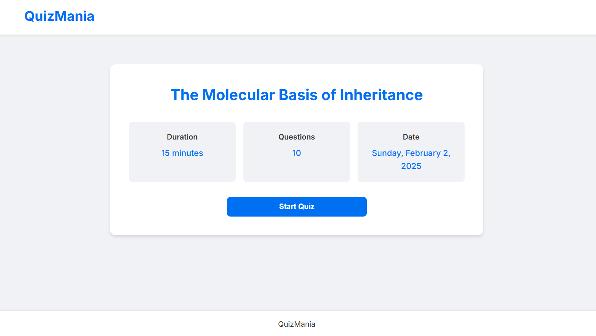
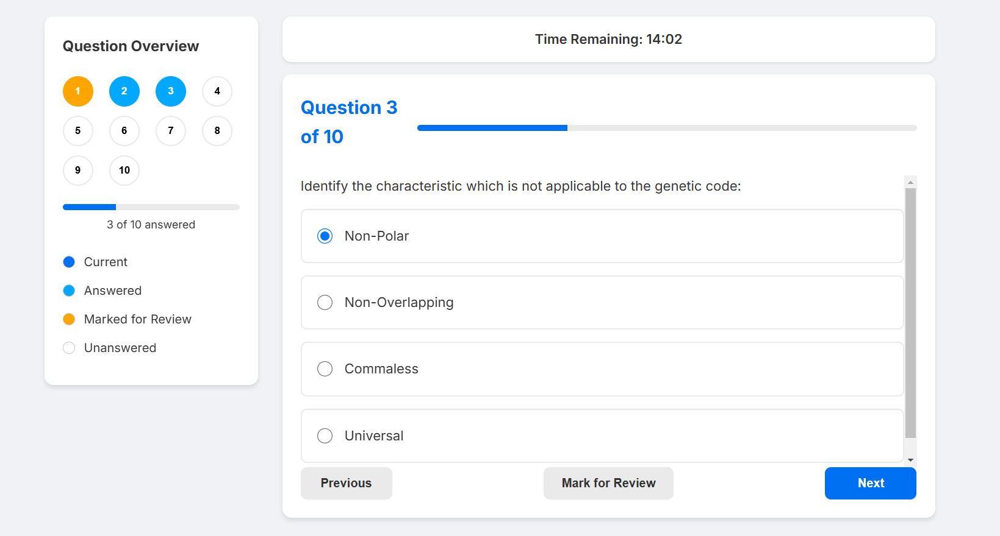
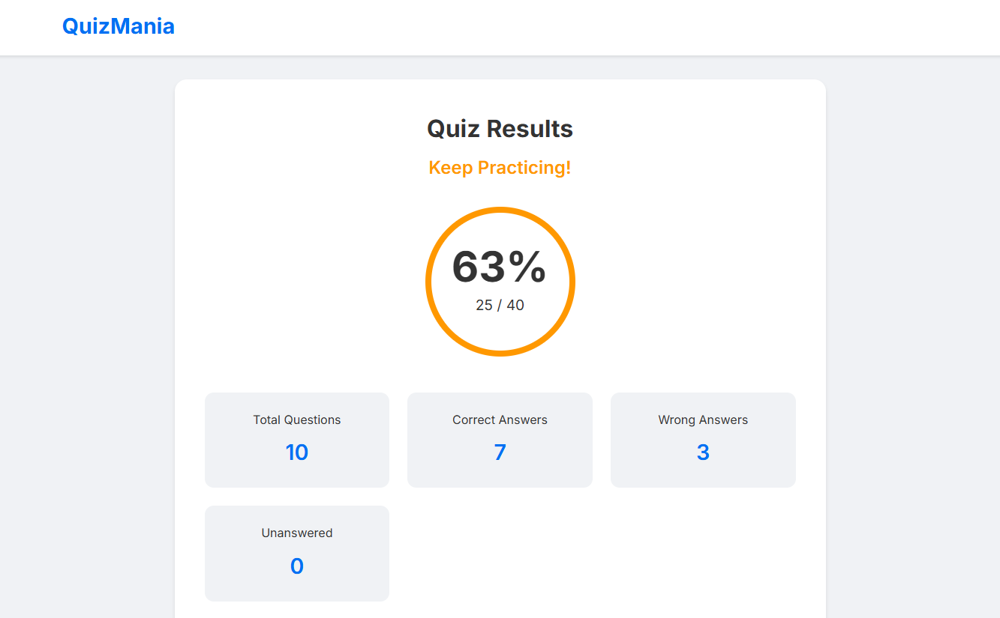
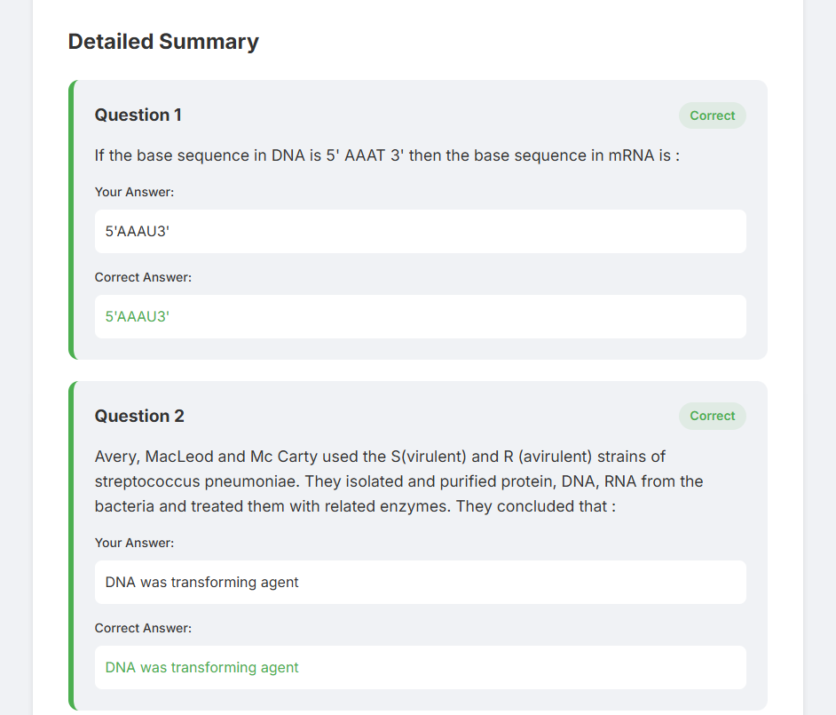

# 🏆 Quiz Application

## 📌 Overview
This project is a web-based quiz application built using **React and Vite**, featuring gamification elements for an engaging user experience. It fetches quiz data from an API and presents multiple-choice questions with a result summary.

## 🚀 Tech Stack
- **Frontend:** React + Vite (JavaScript)
- **Styling:** CSS/Tailwind
- **API:** Quiz Data API

## 🎯 Features
- ✅ **Dynamic Quiz Data** – Fetches questions from API.
- ✅ **Multiple-Choice Questions** – Interactive UI with answer selection.
- ✅ **Performance Summary** – Displays total points scored at the end.
- ✅ **Gamification Elements** – Engaging UI/UX for a better experience.

## ⚙️ Installation and Setup
### Steps
## Clone the repository
```
git clone https://github.com/amank1902/quiz.git
cd quiz
```

## Install dependencies
```
npm install
```
## Start the development server
```
npm run dev
```
Open your browser and navigate to the provided localhost URL.

## Screenshots & Visualizations

Here are some visualizations related to the project:

<!-- First row with two images side by side -->
<div style="display: flex; justify-content: space-between;">
  
  
  
  
</div>
